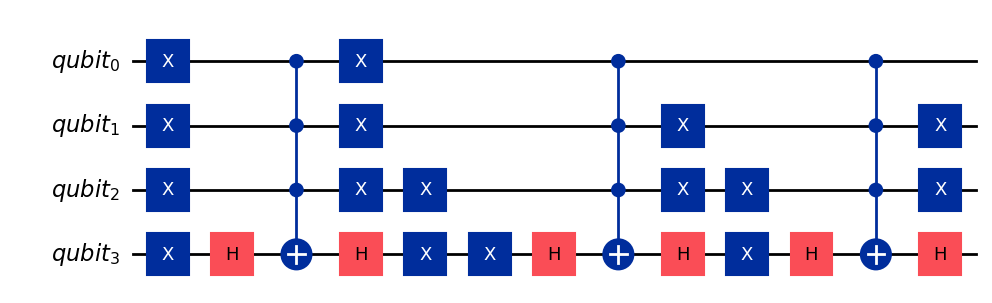
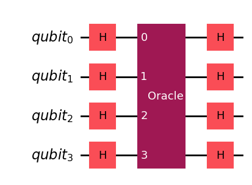
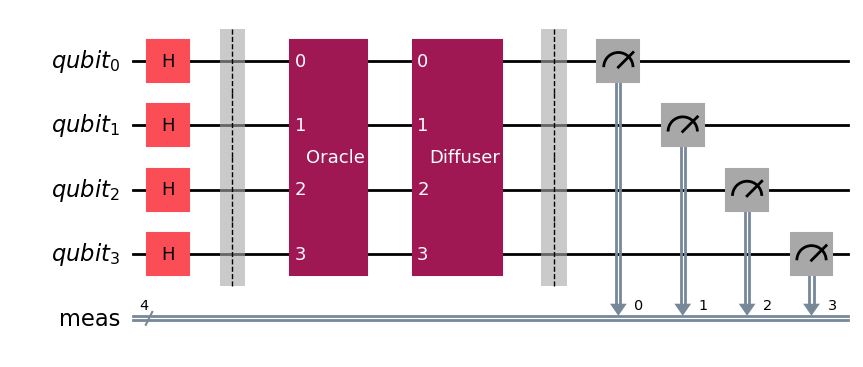
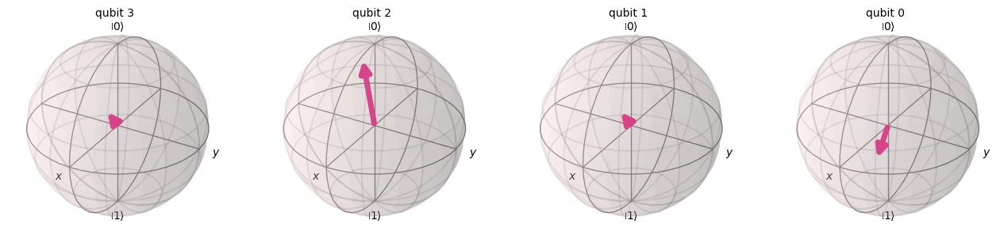
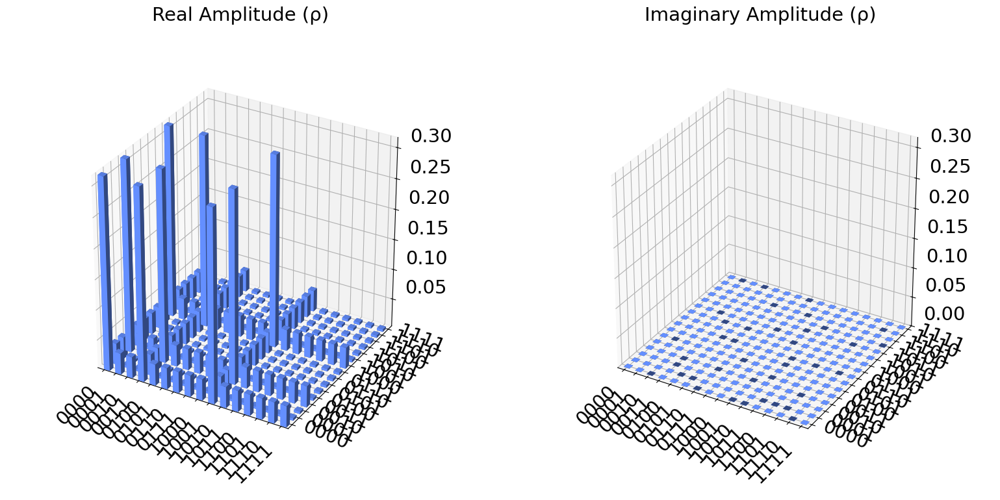
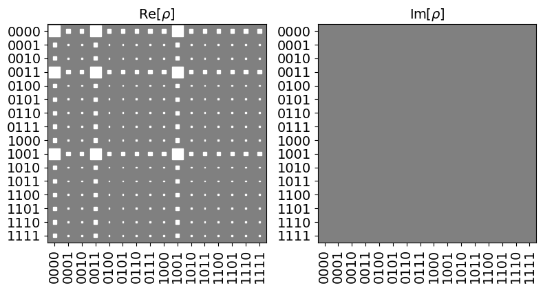
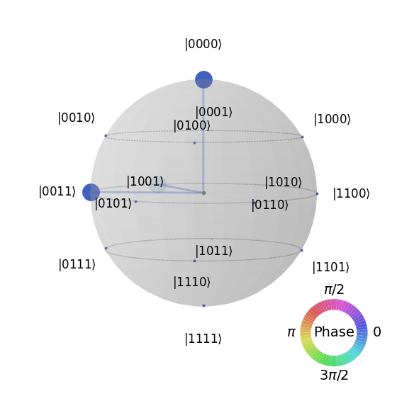
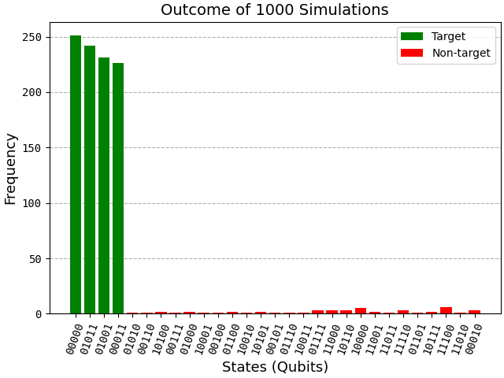
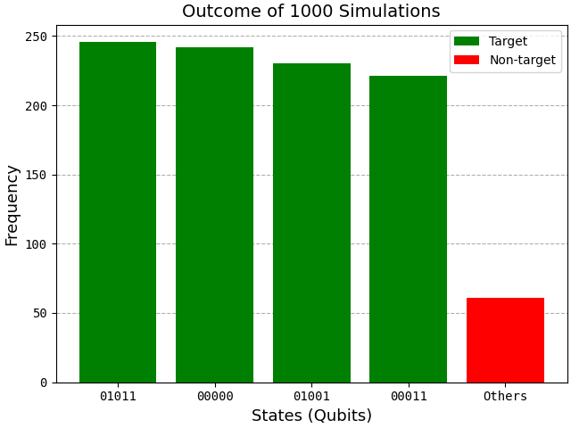
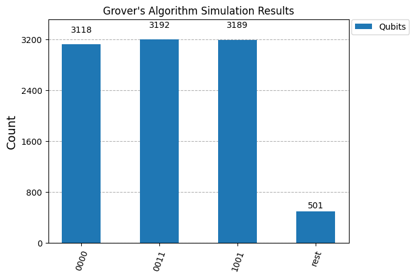

<div align="center">
<h1>Grover's Algorithm</h1>


<br>


<a target="_blank" href="https://deepwiki.com/lynkos/grovers-algorithm" title="DeepWiki for lynkos/grovers-algorithm repository"></a>
</div>

> [!IMPORTANT]
> This repository has accompanying blog posts on [my blog](https://blog.lynkos.dev)!
> 
> * [**Quantum Search Algorithm**](https://blog.lynkos.dev/posts/grover): Short, Twitter/X-inspired thread format
> * [**Quantum Search Algorithm (Full)**](https://blog.lynkos.dev/posts/grover-full): Full explanation with additional details
> 
> These blog posts are much more readable and user-friendly than this repository by itself and GitHub. If you're interested in sharing or reading this repository as a blog post, please feel free to refer to the aforementioned links!

## Requirements
- [x] [Anaconda](https://docs.continuum.io/free/anaconda/install) **OR** [Miniconda](https://docs.conda.io/projects/miniconda/en/latest)

> [!TIP]
> If you have trouble deciding between Anaconda and Miniconda, please refer to the table below
> <table>
>  <thead>
>   <tr>
>    <th><center>Anaconda</center></th>
>    <th><center>Miniconda</center></th>
>   </tr>
>  </thead>
>  <tbody>
>   <tr>
>    <td>New to conda and/or Python</td>
>    <td>Familiar with conda and/or Python</td>
>   </tr>
>   <tr>
>    <td>Not familiar with using terminal and prefer GUI</td>
>    <td>Comfortable using terminal</td>
>   </tr>
>   <tr>
>    <td>Like the convenience of having Python and 1,500+ scientific packages automatically installed at once</td>
>    <td>Want fast access to Python and the conda commands and plan to sort out the other programs later</td>
>   </tr>
>   <tr>
>    <td>Have the time and space (a few minutes and 3 GB)</td>
>    <td>Don't have the time or space to install 1,500+ packages</td>
>   </tr>
>   <tr>
>    <td>Don't want to individually install each package</td>
>    <td>Don't mind individually installing each package</td>
>   </tr>
>  </tbody>
> </table>
>
> Typing out entire Conda commands can sometimes be tedious, so I wrote a shell script ([`conda_shortcuts.sh` on GitHub Gist](https://gist.github.com/lynkos/7a4ce7f9e38bb56174360648461a3dc8)) to define shortcuts for commonly used Conda commands.
> <details>
>   <summary>Example: Delete/remove a conda environment named <code>test_env</code></summary>
>
> * Shortcut command
>     ```
>     rmenv test_env
>     ```
> * Manually typing out the entire command
>     ```sh
>     conda env remove -n test_env && rm -rf $(conda info --base)/envs/test_env
>     ```
>
> The shortcut has 80.8% less characters!
> </details>

## Installation
1. Verify that conda is installed
   ```
   conda --version
   ```
2. Ensure conda is up to date
   ```
   conda update conda
   ```
3. Enter the directory where you want the repository ([`grovers-algorithm`](https://github.com/lynkos/grovers-algorithm)) to be cloned
     * POSIX
       ```sh
       cd ~/path/to/directory
       ```
     * Windows
       ```sh
       cd C:\Users\user\path\to\directory
       ```
4. Clone the repository ([`grovers-algorithm`](https://github.com/lynkos/grovers-algorithm)), then enter (i.e. `cd` command) `grovers-algorithm` directory
   ```sh
   git clone https://github.com/lynkos/grovers-algorithm.git && cd grovers-algorithm
   ```
5. Create a conda virtual environment from [`environment.yml`](environment.yml)
   ```
   conda env create -f environment.yml
   ```
6. Activate the virtual environment (`grovenv`)
   ```
   conda activate grovenv
   ```
7. Confirm that the virtual environment (`grovenv`) is active
     * If active, the virtual environment's name should be in parentheses () or brackets [] before your command prompt, e.g.
       ```
       (grovenv) $
       ```
     * If necessary, see which environments are available and/or currently active (active environment denoted with asterisk (*))
       ```
       conda info --envs
       ```
       **OR**
       ```
       conda env list
       ```

## Usage
> [!TIP]
> If you're unsure about which subsection(s) to follow, please refer to the table below
> <table>
>  <thead>
>   <tr>
>    <th><center>Visual Studio Code</center></th>
>    <th><center>Command Line</center></th>
>   </tr>
>  </thead>
>  <tbody>
>   <tr>
>    <td>Beginner/User-friendly</td>
>    <td>Recommended if familiar with using terminals/shells/CLIs</td>
>   </tr>
>   <tr>
>    <td>GUI</td>
>    <td>CLI</td>
>   </tr>
>   <tr>
>    <td>Click a button to run program</td>
>    <td>Execute a command in terminal/shell/CLI to run program</td>
>   </tr>
>  </tbody>
> </table>

### Python Script
> [!NOTE]
> Although they both perform the same function, there's a discernable difference between [`grovers_algorithm.py`](src/grovers_algorithm.py) and [`grovers_algorithm.ipynb`](src/grovers_algorithm.ipynb). The former is a Python script, the latter is a Jupyter notebook.

#### Command Line (Recommended)
Run [`grovers_algorithm.py`](src/grovers_algorithm.py)
```sh
python src/grovers_algorithm.py
```

<details open>
   <summary>Command Line Arguments</summary>
   <table align="center" style="width: 100%; text-align: center; display: block; max-width: -moz-fit-content; max-width: fit-content; overflow-x: auto;">
       <thead>
       <tr>
           <th align="center">Option</th>
           <th align="center">Type</th>
           <th align="center">Description</th>
           <th align="center">Default</th>
       </tr>
       </thead>
       <tbody>
       <tr>
           <td align="center" style="white-space: nowrap;"><code>-H, --help</code></td>
           <td align="center"></td>
           <td align="center">Show help message and exit</td>
           <td align="center"></td>
       </tr>
       <tr>
           <td align="center" style="white-space: nowrap;"><code>-T, --title &lt;title&gt;</code></td>
           <td align="center"><code>str</code></td>
           <td align="center">Window title</td>
           <td align="center">"Grover's Algorithm"</td>
       </tr>
       <tr>
           <td id="modpath" align="center" style="white-space: nowrap;"><code>-n, --n-qubits &lt;n_qubits&gt;</code></td>
           <td align="center"><code>int</code></td>
           <td align="center">Number of qubits</td>
           <td align="center"><code>5</code></td>
       </tr>
       <tr>
           <td align="center" style="white-space: nowrap;"><code>-s, --search &lt;search&gt;</code></td>
           <td align="center"><code>int</code></td>
           <td align="center">Nonnegative integers to search for</td>
           <td align="center"><code>11 9 0 3</code><br>(i.e., { 11, 9, 0, 3 })</td>
       </tr>
       <tr>
           <td align="center" style="white-space: nowrap;"><code>-S, --shots &lt;shots&gt;</code></td>
           <td align="center"><code>int</code></td>
           <td align="center">Number of simulations</td>
           <td align="center"><code>1000</code></td>
       </tr>
       <tr>
           <td align="center" style="white-space: nowrap;"><code>-f, --font-size &lt;font_size&gt;</code></td>
           <td align="center"><code>int</code></td>
           <td align="center">Histogram's font size</td>
           <td align="center"><code>10</code></td>
       </tr>
       <tr>
           <td align="center" style="white-space: nowrap;"><code>-p, --print</code></td>
           <td align="center"><code>bool</code></td>
           <td align="center">Whether or not to print quantum circuit(s)</td>
           <td align="center"><code>False</code></td>
       </tr>
       <tr>
           <td align="center" style="white-space: nowrap;"><code>-c, --combine</code></td>
           <td align="center"><code>bool</code></td>
           <td align="center">Whether to combine all non-winning states into 1 bar labeled "Others" or not</td>
           <td align="center"><code>False</code></td>
       </tr>
       </tbody>
   </table>
</details>

#### Visual Studio Code
1. Open [`grovers_algorithm.py`](src/grovers_algorithm.py)
2. Run [`grovers_algorithm.py`](src/grovers_algorithm.py): Click `▷` (i.e. `Play` button) in the upper-right corner

### Jupyter Notebook
#### Visual Studio Code (Recommended)
1. Open the Command Palette with the relevant keyboard shortcut
    * Mac: <kbd>⌘</kbd> + <kbd>Shift</kbd> + <kbd>P</kbd>
    * Windows: <kbd>CTRL</kbd> + <kbd>Shift</kbd> + <kbd>P</kbd>
2. Search and select `Python: Select Interpreter`
3. Select the virtual environment (`grovenv`)
4. Open [`grovers_algorithm.ipynb`](src/grovers_algorithm.ipynb)
5. Confirm `grovenv` is the selected [kernel](https://docs.jupyter.org/en/latest/install/kernels.html)
6. Run [`grovers_algorithm.ipynb`](src/grovers_algorithm.ipynb) by clicking `Run All`

#### Command Line
1. Install `ipykernel` in the virtual environment (`grovenv`)
   ```
   conda install -n grovenv ipykernel
   ```
2. Add the virtual environment (`grovenv`) as a Jupyter kernel
   ```
   python -m ipykernel install --user --name=grovenv
   ```
3. Open [`grovers_algorithm.ipynb`](src/grovers_algorithm.ipynb) in the currently running notebook server, starting one if necessary
   ```
   jupyter notebook src/grovers_algorithm.ipynb
   ```
4. Select the virtual environment (`grovenv`) as the kernel before running [`grovers_algorithm.ipynb`](src/grovers_algorithm.ipynb)

## Cleanup
1. [Optional] Deactivate the virtual environment (`grovenv`) to clean up and remove it
   ```
   conda deactivate
   ```
2. Close the terminal

## Examples
These serve as example outputs/results of the running Grover's algorithm (i.e. files in [`src`](src))

### Quantum Circuits
Generated by [`grovers_algorithm.ipynb`](src/grovers_algorithm.ipynb) (i.e. Jupyter notebook)

#### Oracle
<div align="center">
   <figure>
      <picture></picture><br>
      <figcaption style="font-size: 11px;"></figcaption>
   </figure>
</div>

#### Diffuser
<div align="center">
   <figure>
      <picture></picture><br>
      <figcaption style="font-size: 11px;"></figcaption>
   </figure>
</div>

#### Grover
<div align="center">
   <figure>
      <picture></picture><br>
      <figcaption style="font-size: 11px;"></figcaption>
   </figure>
</div>

### Figures
Generated by [`grovers_algorithm.ipynb`](src/grovers_algorithm.ipynb) (i.e. Jupyter notebook)

#### Bloch Sphere
<div align="center">
   <figure>
      <picture></picture><br>
      <figcaption style="font-size: 11px;"></figcaption>
   </figure>
</div>

#### City Plot
<div align="center">
   <figure>
      <picture></picture><br>
      <figcaption style="font-size: 11px;"></figcaption>
   </figure>
</div>

#### Hinton Plot
<div align="center">
   <figure>
      <picture></picture><br>
      <figcaption style="font-size: 11px;"></figcaption>
   </figure>
</div>

#### Q-Sphere
<div align="center">
   <figure>
      <picture></picture><br>
      <figcaption style="font-size: 11px;"></figcaption>
   </figure>
</div>

### Simulations
Histograms visualize the outcome/results of 1000 simulations of Grover's algorithm

#### [Python](src/grovers_algorithm.py)
Generated by [`grovers_algorithm.py`](src/grovers_algorithm.py) (i.e. Python script)

> [!TIP]
> Hovering above a bar in the histogram displays that state's frequency

<div align="center">
   <figure>
      <picture></picture><br>
      <figcaption style="font-size: 11px;">Histogram of the outcome of 1000 simulations of Grover's algorithm</figcaption>
   </figure>
</div>
<br>
<div align="center">
   <figure>
      <picture></picture><br>
      <figcaption style="font-size: 11px;">Histogram of the outcome of 1000 simulations of Grover's algorithm, with all non-target states combined into a single bar</figcaption>
   </figure>
</div>

#### [Jupyter Notebook](src/grovers_algorithm.ipynb)
Generated by [`grovers_algorithm.ipynb`](src/grovers_algorithm.ipynb) (i.e. Jupyter notebook)

<div align="center">
   <figure>
      <picture></picture><br>
      <figcaption style="font-size: 11px;">Histogram of the outcome of 1000 simulations of Grover's algorithm</figcaption>
   </figure>
</div>

## Resources
* [Anaconda Documentation](https://docs.anaconda.com)
* [Conda Documentation](https://docs.conda.io/en/latest)
* [Getting Started with Conda](https://conda.io/projects/conda/en/latest/user-guide/getting-started.html)
* [Jupyter Notebook Documentation](https://jupyter-notebook.readthedocs.io/en/latest)
* [Jupyter Project Documentation](https://docs.jupyter.org/en/latest/index.html) [[PDF](https://buildmedia.readthedocs.org/media/pdf/jupyter/latest/jupyter.pdf)]
* [Technical Support - Jupyter Google Group](https://discourse.jupyter.org)
* [Qiskit Documentation](https://qiskit.org/documentation/index.html)
* [Documentation for Visual Studio Code](https://code.visualstudio.com/docs)
* [Using Jupyter Notebooks in Visual Studio Code](https://code.visualstudio.com/docs/datascience/jupyter-notebooks)

## Credit
Special thanks to [Simanraj Sadana](https://sqmscenter.fnal.gov/profile/simanraj-sadana) for "[Grover's search algorithm for *n* qubits with optimal number of iterations](https://arxiv.org/abs/2011.04051)", which has been a helpful reference and an informative read

## License
Distributed under the [MIT License](LICENSE.md), Copyright © 2023 – 2025 Kiran Brahmatewari
